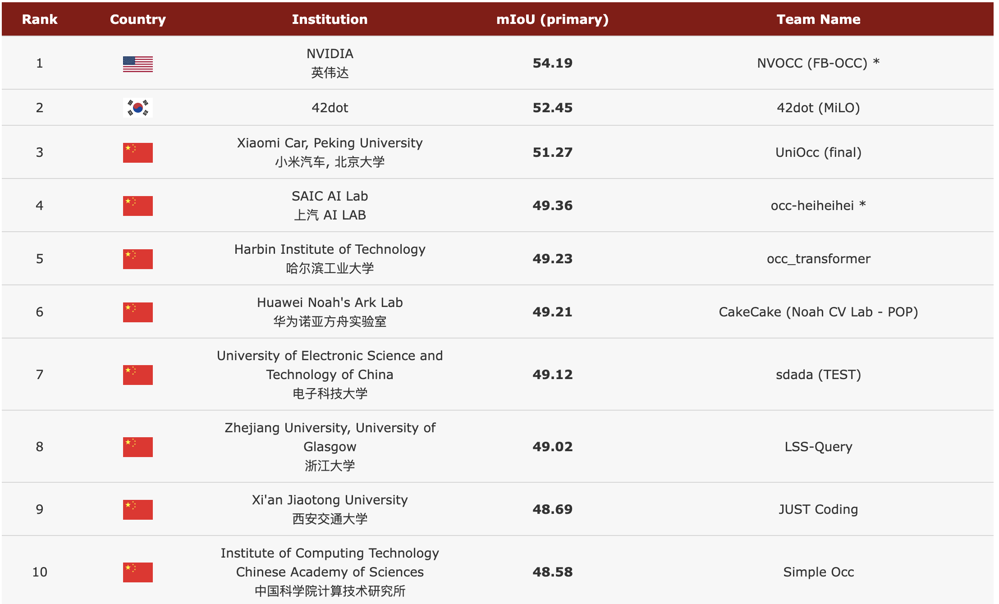

<div id="top" align="center">

# OpenScene

**The Largest Up-to-Date 3D Occupancy Prediction Benchmark in Autonomous Driving**

<a href="#数据">
  
</a>
<a href="#开发工具">
  
</a>
<a href="#许可说明">
  
</a>
  


<p align="center">
  
</p>
  
</div>


> - Medium Blog | Zhihu.com (in Chinese)
> - [CVPR 2023 Autonomous Driving Challenge - Occupancy Track](https://github.com/CVPR2023-3D-Occupancy-Prediction/CVPR2023-3D-Occupancy-Prediction)
> - Point of contact: [contact@opendrivelab.com](mailto:contact@opendrivelab.com)

## Grad-and-Go

- **`[07/21]`** OpenScene `v1.0` released

## Table of Contents
- [Highlights](#highlights)
- [Task and Evaluation Metric](#task-and-evaluation-metric)
- [Ecosystem and Leaderboard](#ecosystem-and-leaderboard)
- [Getting Started](#getting-started)
- [ToDo](#todo)
- [License and Citation](#license-and-citation)
- [Related resources](#related-resources)

## Highlights


### :oncoming_automobile: Representing 3D Scene as Occupancy

<!---

--->

As we quote from [OccNet](https://arxiv.org/abs/2306.02851):

>  **Occupancy** serves as a `general` representation of the scene and could facilitate perception and planning in the full-stack of autonomous driving. 3D Occupancy is a geometry-aware representation of the scene.

Compared to the formulation of `3D bounding box` and `BEV segmentation`,  3D occupancy could capture the fine-grained details of critical obstacles in the driving scene.


### :fire: Scale Up Data: A Massive Dataset for Visual Pre-Training and [DriveAGI](https://github.com/OpenDriveLab/DriveAGI)


**OpenScene: The Largest Dataset for Occupancy**

Driving behavior on a sunny day does not apply to that in dancing snowflakes. For machine learning, data is the `must-have` food. 
To highlight, we build OpenScene on top of [nuPlan](https://www.nuscenes.org/nuplan#challenge), covering a wide span of over **120 hours** of occupancy labels collected in various cities, from `Austin`, `Boston`, `Miami` to `Singapore`.
<!---The diversity of data enables models to generalize in different atmospheres and landscapes.--->


<center>
  
|  Dataset  | Original Database |      Sensor Data (hr)    |   Sweep  | Flow | Semantic Category                               |
|:---------:|:-----------------:|:--------------------:|:-------------:|:------:|:--------------------------------------------:|
| [MonoScene](https://github.com/astra-vision/MonoScene)  |      NYUv2/SemanticKITTI     | 4.1  |  1 | :x:     | 19   |
| [Occ3D](https://github.com/FANG-MING/occupancy-for-nuscenes/tree/main)   |      nuScenes     | 5.5  |  10 | :x:    | 16  |
| [Occupancy-for-nuScenes](https://github.com/FANG-MING/occupancy-for-nuscenes)   |      nuScenes     | 5.5  |  20 | :x:     | 16  |
| [SurroundOcc](https://github.com/weiyithu/SurroundOcc)   |      nuScenes     | 5.5  |  10 | :x:    | 16  |
| [OpenOccupancy](https://github.com/JeffWang987/OpenOccupancy)   |      nuScenes     | 5.5  |  10 | :x:     | 16  |
| [SSCBench](https://github.com/ai4ce/SSCBench)   |      KITTI-360/nuScenes/Waymo     | 13.4  |  10 | :x:     | 16  |
| [OccNet](https://github.com/OpenDriveLab/OccNet)   |      nuScenes     | 5.5  |  **40** | :x:     | 16   |
| **OpenScene** |       nuPlan      | **:boom: 120**  |  **40** | **:heavy_check_mark:**    | **7+X** |

</center>

> - Sweep: the number of LiDAR frames accumulated for occupancy generation.
> - Flow: the annotation of motion direction and velocity for each occupancy grid.
> - X: we will release full semantic labels of grids in future updates for boosting open-vocabulary detection.


<!---
We consider occupancy as a unified representation for various sub-tasks within autonomous driving perception, general scene understanding, and embodied robotics.
The released OpenScene is the largest dataset with occupancy representation.
The pre-training of occupancy detection tasks on massive datasets is expected to benefit various downstream perception-related tasks.
--->


### Beyond Perception: Empowering DriveAGI with Motional Occupancy


What kind of modeling is needed for autonomous driving scenarios to meet the demands of planning-oriented perception?
We posit that incorporating the motion information of **occupancy flow** can help bridge the gap between `decision-making` and `scene representation`.
Besides, the OpenScene dataset provides a semantic label for each foreground grid, serving as a crucial initial step towards achieving [DriveAGI](https://github.com/OpenDriveLab/DriveAGI). 
<!---
Previous occupancy datasets were annotated in a static scene. 
However, in practical applications, static occupancy data cannot support vehicle route planning due to the lack of instance motion information. Therefore, **occupancy flow** data is indispensable.
--->
<!---We will add semantic labels of background grids in future updates for boosting open-vocabulary detection.--->

<!---
### Explore the World Fully: Recognizing Scenarios with Semantic Labels


Recognizing whether the geometric space is occupied is only the first step. 
To drive a car, it is also necessary to identify various **traffic elements** (such as vehicles and obstacles) in the environment. 
The richness of the scene's semantics can greatly ensure driving safety.
We hope that the establishment of this dataset can promote the development of driving scene semantic-level perception tasks. 
The OpenScene dataset provides semantic labels for each foreground grid. 
We will add semantic labels for background grids in future updates.
--->

<p align="right">(<a href="#top">back to top</a>)</p>


## Task and Evaluation Metric

<!---We consider occupancy as a unified representation for various sub-tasks within autonomous driving perception, general scene understanding, and embodied robotics.
The pre-training of occupancy detection tasks on massive data is expected to benefit various downstream perception-related tasks.--->

### Task 1: Large-Scale Occupancy Prediction


The pre-training task is defined as occupancy prediction by the intersection-over-union (**mIoU**) over all classes. 

Let $C$ be the number of classes. 

$$
    \text{mIoU}=\frac{1}{C}\displaystyle \sum_{c=1}^{C}\frac{TP_c}{TP_c+FP_c+FN_c},
$$

where $TP_c$, $FP_c$, and $FN_c$ correspond to the number of true positive, false positive, and false negative predictions for class $c_i$.


### Task 2: All-in-One Model Verification with Diverse Downstream Tasks


After pre-training, the fine-tuning stage allows for diverse downstream tasks to be defined on various datasets.


<!---
| Downstream Tasks | KITTI Metrics | nuScenes Metrics| Waymo Metrics | 
|:---------:|:---------:|:---------:|:---------------:|
| 3D Detection |  :heavy_check_mark: mAP| :heavy_check_mark: [mAP & NDS](https://www.nuscenes.org/object-detection?externalData=all&mapData=all&modalities=Any) | :heavy_check_mark:  [AP & APH](https://waymo.com/open/challenges/2020/3d-detection/)|   
| Semantic Segmentation |  :heavy_check_mark: mIoU| :heavy_check_mark: mIoU|  :heavy_check_mark: mIoU |   
| Scene Completion |  :heavy_check_mark: mIoU| :heavy_check_mark: mIoU| :heavy_check_mark: mIoU  |   
| Map Generation | - | :heavy_check_mark: mIoU| :heavy_check_mark: mIoU  |    
| Object Tracking | :heavy_check_mark: [HOTA](https://link.springer.com/article/10.1007/s11263-020-01375-2)| :heavy_check_mark: [AMOTA & AMOTP](https://www.nuscenes.org/tracking?externalData=all&mapData=all&modalities=Any)|  :heavy_check_mark:[MOTA & MOTP](https://waymo.com/open/challenges/2020/3d-tracking/) |  
| Depth Estimation |  :heavy_check_mark: [SILog](https://www.cvlibs.net/datasets/kitti/eval_depth.php?benchmark=depth_prediction)| :heavy_check_mark: [Abs Rel](https://arxiv.org/abs/2204.03636)| - |
| Visual Odometry |  :heavy_check_mark: [Translation](https://www.cvlibs.net/datasets/kitti/eval_odometry.php)| - |  - | 
| Flow Estimation |  :heavy_check_mark: [Fl-all](https://www.cvlibs.net/datasets/kitti/eval_scene_flow.php?benchmark=flow) |  - | :heavy_check_mark: [EPE](https://waymo.com/open/challenges/2022/occupancy-flow-prediction-challenge/) |
| 3D Lane Detection | - |:heavy_check_mark: [mAP](https://github.com/OpenDriveLab/OpenLane-V2/) | :heavy_check_mark: [F1-Score](https://github.com/OpenDriveLab/OpenLane) |  
--->

<center>

| Downstream Task | KITTI | nuScenes| Waymo | Scene Diversity| OSM |
|:---------:|:---------:|:---------:|:---------------:|:---------:|:---:|
| 3D Detection |  | :heavy_check_mark:  | |   | [NDS](https://www.nuscenes.org/object-detection?externalData=all&mapData=all&modalities=Any) |
| Semantic Segmentation |  | :heavy_check_mark: |  |  | mIoU |   
| Scene Completion |  | :heavy_check_mark: |   |   | mIoU |
| Map Construction |  | :heavy_check_mark: |   |    | mAP  |
| Object Tracking | |  |  :heavy_check_mark: |   | [MOTA](https://waymo.com/open/challenges/2020/3d-tracking/)  |  
| Depth Estimation |  :heavy_check_mark: |  |  |   | [SILog](https://www.cvlibs.net/datasets/kitti/eval_depth.php?benchmark=depth_prediction)  |
| Visual Odometry |  :heavy_check_mark: |  |   |   |  [Translation](https://www.cvlibs.net/datasets/kitti/eval_odometry.php)  |
| Flow Estimation |  :heavy_check_mark:  |   |  |   | [Fl-all](https://www.cvlibs.net/datasets/kitti/eval_scene_flow.php?benchmark=flow)   |
| 3D Lane Detection |  |  | :heavy_check_mark:  |  | [F1-Score](https://github.com/OpenDriveLab/OpenLane) |

</center>


## Ecosystem and Leaderboard

### Upcoming Challenge in 2024

We plan to release a trailer version of the upcoming challenge. Please stay tuned for more details in `Late August`.
- Challenge Page: [Private-AD24](/docs/challenge.md) (TBA)


### CVPR 2023 3D Occupancy Prediction Challenge (Server remains `active`)

Given images from multiple cameras, the goal is to predict the current occupancy state and semantics of each voxel grid in the scene. The voxel state is predicted to be either free or occupied. If a voxel is occupied, its semantic class needs to be predicted, as well. Besides, we also provide a binary observed/unobserved mask for each frame. An observed voxel is defined as an invisible grid in the current camera observation, which is ignored in the evaluation stage.


- Challenge website: [AD23Challenge](https://opendrivelab.com/AD23Challenge.html#Track3)



<p align="right">(<a href="#top">back to top</a>)</p>


## TODO 
- [x] 3D Occupancy and flow dataset `v1.0`
- [ ] Devkit release `v1.0`
- [ ] Full semantic labels
- [ ] Upcoming challenge

<p align="right">(<a href="#top">back to top</a>)</p>


## Getting Started
- [Download Data](/docs/getting_started.md#download-data)
- [Install Devkit](/docs/getting_started.md#install-devkit)
- [Prepare Dataset](/docs/getting_started.md#prepare-dataset)
- [Train a Model](/docs/getting_started.md#train-a-model)


<p align="right">(<a href="#top">back to top</a>)</p>


## License and Citation
All assets (including figures and data) and code are under the [Apache 2.0 license](./LICENSE) unless specified otherwise.
Please consider citing our paper if the project helps your research with the following BibTex:
```bibtex
@article{sima2023_occnet,
      title={Scene as Occupancy}, 
      author={Chonghao Sima and Wenwen Tong and Tai Wang and Li Chen and Silei Wu and Hanming Deng  and Yi Gu and Lewei Lu and Ping Luo and Dahua Lin and Hongyang Li},
      year={2023},
      eprint={2306.02851},
      archivePrefix={arXiv},
      primaryClass={cs.CV}
}
```

<p align="right">(<a href="#top">back to top</a>)</p>

## Related resources
[](https://awesome.re)
- [DriveAGI](https://github.com/OpenDriveLab/DriveAGI) | [DriveLM](https://github.com/OpenDriveLab/DriveLM) (TBA) | [OpenLane-V2](https://github.com/OpenDriveLab/OpenLane-V2)
- [OccNet](https://github.com/OpenDriveLab/OccNet)
- [Bird's-eye-view Perception](https://github.com/OpenDriveLab/BEVPerception-Survey-Recipe) | [BEVFormer](https://github.com/fundamentalvision/BEVFormer)


<p align="right">(<a href="#top">back to top</a>)</p>


