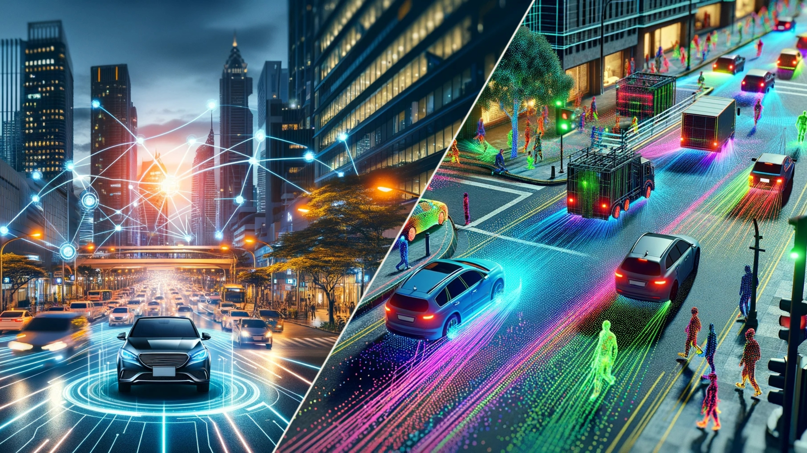

<div id="top" align="center">

# OpenScene: Autonomous Grand Challenge Toolkits

**The large-scale dataset used for the `End-to-End Driving` and `Predictive World Model` tracks for the [CVPR 2024 Autonomous Grand Challenge](https://opendrivelab.com/challenge2024).**

<p align="center">
  
</p>
</div>

## News

- **`2024/03/18`** We updated the [test metadata](/docs/getting_started.md#test-set) with box annotations, please re-download it.
- **`2024/03/01`** OpenScene `v1.1` released, [change log](/docs/getting_started.md#openscene-v11).
- **`2024/03/01`** We are hosting **CVPR 2024 Autonomous Grand Challenge**.

## Table of Contents

1. [Track: End-to-End Driving at Scale](#navsim)
2. [Track: Predictive World Model](#worldmodel)
3. [Dataset: OpenScene](#dataset)
4. [License and Citation](#license-and-citation)
5. [Related Resources](#resources)

## Track: End-to-End Driving at Scale <a name="navsim"></a>
<div id="top" align="center">
<p align="center">
  
</p>
</div>

> - Official website: :globe_with_meridians: [AGC2024](https://opendrivelab.com/challenge2024/#end_to_end_driving_at_scale)
> - Evaluation server: :hugs: [Hugging Face](https://huggingface.co/spaces/AGC2024-P/e2e-driving-2024)
> - Development Kit: :ringed_planet: [NAVSIM](https://github.com/autonomousvision/navsim)

- [Problem Formulation](#navsim-baseline)
- [Evaluation: PDM Score](#navsim-eval)
- [Submission](#navsim-submission)

NAVSIM gathers simulation-based metrics (such as progress and time to collision) for end-to-end driving by unrolling simplified bird's eye view abstractions of scenes for a short simulation horizon. It operates under the condition that the policy has no influence on the environment, which enables efficient, open-loop metric computation while being better aligned with closed-loop evaluations than traditional displacement errors.

### Problem Formulation <a name="navsim-baseline"></a>
Given sensor inputs (multi-view images from 8 cameras, LiDAR, ego states, and discrete navigation commands) for a 2-second history, the end-to-end planner must output a safe trajectory for the ego vehicle to navigate along for the next 4 seconds. More information is available in the [NAVSIM docs](https://github.com/kashyap7x/navsim/blob/internal_main/docs/agents.md).

### Evaluation: PDM Score <a name="navsim-eval"></a>
Fair comparisons are challenging in the open-loop planning literature, due to metrics of narrow scope or inconsistent definitions between different projects. The PDM Score is a combination of six sub-metrics, which provides a comprehensive analysis of different aspects of driving performance. Five of these sub-metrics are discrete-valued, and one is continuous. All metrics are computed after a 4-second non-reactive simulation of the planner output: background actors follow their recorded future trajectories, and the ego vehicle moves based on an LQR controller. More information is available in the [NAVSIM docs](https://github.com/kashyap7x/navsim/blob/internal_main/docs/metrics.md).

### Submission <a name="navsim-submission"></a>
The evaluation server at [Hugging Face](https://huggingface.co/spaces/AGC2024-P/e2e-driving-2024) will be open around `late March`!

## Track: Predictive World Model <a name="worldmodel"></a>
<div id="top" align="center">
<p align="center">
  
</p>
</div>

> - Official website: :globe_with_meridians: [AGC2024](https://opendrivelab.com/challenge2024/#predictive_world_model)
> - Evaluation server: :hugs: [Hugging Face](https://huggingface.co/spaces/AGC2024-P/predictive-world-model-2024)

- [Problem Formulation](#worldmodel-baseline)
- [Evaluation: Chamfer Distance](#worldmodel-eval)
- [Submission](#worldmodel-submission)

Serving as an abstract spatio-temporal representation of reality, the world model can predict future states based on the current state. The learning process of world models has the potential to provide a pre-trained foundation model for autonomous driving. Given vision-only inputs, the neural network outputs point clouds in the future to testify its predictive capability of the world.

### Problem Formulation <a name="worldmodel-baseline"></a>
Given an visual observation of the world for the past 3 seconds, predict the point clouds in the future 3 seconds based on the designated
future ego-vehicle pose. In other words,
given historical images in 3 seconds and corresponding history ego-vehicle pose information (from -2.5s to 0s, 6 frames under 2 Hz),
the participants are required to forecast future point clouds
in 3 seconds (from 0.5s to 3s, 6 frames under 2Hz) with specified future ego-poses.

All output point clouds should be aligned to the LiDAR coordinates of the ego-vehicle in the `n` timestamp, which spans a
range of 1 to 6 given predicting 6 future frames.

We then evaluate the predicted future point clouds by querying rays. We will provide a set of query rays for testing propose,
and `the participants are required to estimate depth along each ray for rendering point clouds. An example of submission 
will be provided soon.` Our evaluation toolkit will render
point clouds according to ray directions and provided depths by participants, and compute chamfer distance for points within
the range from -51.2m to 51.2m on the X- and Y-axis as the criterion.

For more details, please refer to [ViDAR](https://github.com/OpenDriveLab/ViDAR).

### Evaluation: Chamfer Distance <a name="worldmodel-eval"></a>
Chamfer Distance is used for measuring the similarity of two point sets, which represent shapes or outlines of two scenens.
It compares the similarity between predicted and ground-truth shapes by calculating the average nearest-neighbor distance between
points in one set to points in the other set, and vice versa.

For this challenge, we will compare chamfer distance between predicted point clouds and ground-truth point clouds for points
within the range of -51.2m to 51.2m. Participants are required to provide depths of specified ray directions. Our evaluation
system will render point clouds by ray directions and provided depth for chamfer distance evaluation.

### Submission <a name="worldmodel-submission"></a>
The evaluation server at [Hugging Face](https://huggingface.co/spaces/AGC2024-P/predictive-world-model-2024) will be open around `late March`!

## Dataset: OpenScene <a name="dataset"></a>

<div id="top" align="center">
<p align="center">
  
</p>
</div>

> - [Medium Blog](https://medium.com/@opendrivelab/introducing-openscene-the-largest-benchmark-for-occupancy-prediction-in-autonomous-driving-74cfc5bbe7b6) | [Zhihu](https://zhuanlan.zhihu.com/p/647953862) (in Chinese)
> - Point of contact: [contact@opendrivelab.com](mailto:contact@opendrivelab.com)

### Description
OpenScene is a compact redistribution of the large-scale [nuPlan](https://www.nuscenes.org/nuplan#challenge) dataset, retaining only relevant annotations and sensor data at 2Hz. This reduces the dataset size by a factor of >10. We cover a wide span of over **120 hours**, and provide additional **occupancy labels** collected in various cities, from `Boston`, `Pittsburgh`, `Las Vegas` to `Singapore`.

The stats of the dataset are summarized [here](docs/dataset_stats.md).

<center>
  
|  Dataset  | Original Database |      Sensor Data (hr)    |   Flow | Semantic Categories                               |
|:---------:|:-----------------:|:--------------------:|:------:|:--------------------------------------------:|
| [MonoScene](https://github.com/astra-vision/MonoScene)  |      NYUv2 / SemanticKITTI     | 5 / 6  |  :x:     | 10 / 19   |
| [Occ3D](https://github.com/Tsinghua-MARS-Lab/Occ3D)   |      nuScenes / Waymo    | 5.5 / 5.7 |  :x:    | 16 / 14 |
| [Occupancy-for-nuScenes](https://github.com/FANG-MING/occupancy-for-nuscenes)   |      nuScenes     | 5.5  |  :x:     | 16  |
| [SurroundOcc](https://github.com/weiyithu/SurroundOcc)   |      nuScenes     | 5.5  |   :x:    | 16  |
| [OpenOccupancy](https://github.com/JeffWang987/OpenOccupancy)   |      nuScenes     | 5.5  |  :x:     | 16  |
| [SSCBench](https://github.com/ai4ce/SSCBench)   |      KITTI-360 / nuScenes / Waymo     | 1.8 / 4.7 / 5.6  |   :x:     | 19 / 16 / 14  |
| [OccNet](https://github.com/OpenDriveLab/OccNet)   |      nuScenes     | 5.5  |   :x:     | 16   |
| **OpenScene** |       nuPlan      | **:boom: 120**  |   **:heavy_check_mark:**    | **`TODO`** |

</center>

> - The time span of LiDAR frames accumulated for each occupancy annotation is **20** seconds.
> - Flow: the annotation of motion direction and velocity for each occupancy grid.
> - `TODO`: Full semantic labels of grids would be released in future version

### Getting Started
- [Download Data](/docs/getting_started.md#download-data)
- [Prepare Dataset](/docs/getting_started.md#prepare-dataset)

## License and Citation <a name="license-and-citation"></a>
> Our dataset is based on the [nuPlan Dataset](https://www.nuscenes.org/nuplan) and therefore we distribute the data under [Creative Commons Attribution-NonCommercial-ShareAlike](https://creativecommons.org/licenses/by-nc-sa/4.0/legalcode) license and [nuPlan Dataset License Agreement for Non-Commercial Use](https://www.nuscenes.org/terms-of-use). You are free to share and adapt the data, but have to give appropriate credit and may not use the work for commercial purposes.
All code within this repository is under [Apache License 2.0](https://www.apache.org/licenses/LICENSE-2.0).

Please consider citing our paper if the project helps your research with the following BibTex:

```bibtex
@article{yang2023vidar,
  title={Visual Point Cloud Forecasting enables Scalable Autonomous Driving},
  author={Yang, Zetong and Chen, Li and Sun, Yanan and Li, Hongyang},
  journal={arXiv preprint arXiv:2312.17655},
  year={2023}
}

@misc{openscene2023,
      title = {OpenScene: The Largest Up-to-Date 3D Occupancy Prediction Benchmark in Autonomous Driving},
      author = {OpenScene Contributors},
      howpublished={\url{https://github.com/OpenDriveLab/OpenScene}},
      year = {2023}
}

@article{sima2023_occnet,
      title={Scene as Occupancy}, 
      author={Chonghao Sima and Wenwen Tong and Tai Wang and Li Chen and Silei Wu and Hanming Deng  and Yi Gu and Lewei Lu and Ping Luo and Dahua Lin and Hongyang Li},
      year={2023},
      eprint={2306.02851},
      archivePrefix={arXiv},
      primaryClass={cs.CV}
}
```

<p align="right">(<a href="#top">back to top</a>)</p>

## Related Resources  <a name="resources"></a>
[](https://awesome.re)
- [DriveAGI](https://github.com/OpenDriveLab/DriveAGI)  | [OpenLane-V2](https://github.com/OpenDriveLab/OpenLane-V2) | [DriveLM](https://github.com/OpenDriveLab/DriveLM)
- [Survey on Bird's-eye-view Perception](https://github.com/OpenDriveLab/BEVPerception-Survey-Recipe) | [BEVFormer](https://github.com/fundamentalvision/BEVFormer) |  [OccNet](https://github.com/OpenDriveLab/OccNet)


<p align="right">(<a href="#top">back to top</a>)</p>


